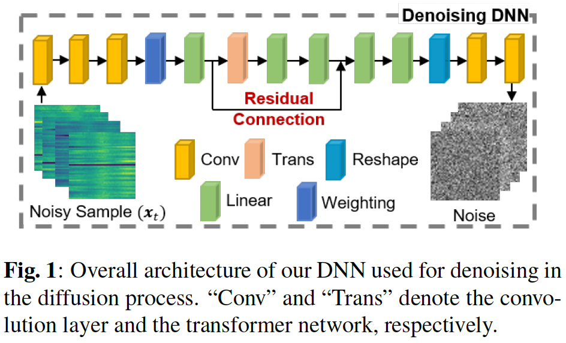
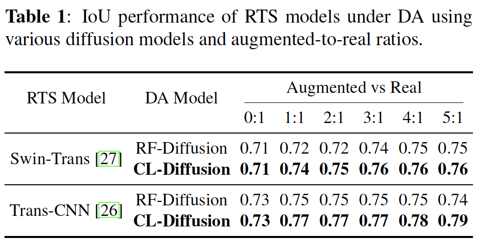
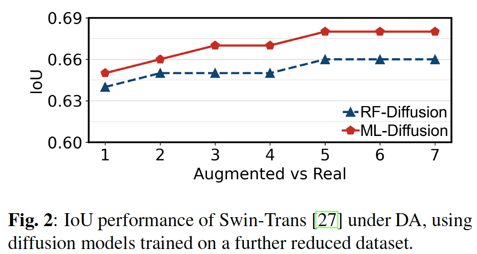

# CL-Diffusion

We introduce CL-Diffusion, a novel diffusion model for augmenting WiFi CSI data, thereby reducing data collection time and enhancing underground root tuber sensing (RTS) performance. Unlike previous diffusion models, CL-Diffusion explicitly captures dependencies among correlated links through a tailored neural network. This design reduces deviations and ensures the generated samples closely align with the real data distribution. Specifically, we design a novel DNN for denoising in the diffusion process, with the architecture illustrated as follows. 
<p align="center">
  
</p>

We have released the pre-trained model and part of the corresponding data files in releases, which can be used for performance testing.

# Prerequisite and Evaluation
## 2.1 Prerequisite
CL-Diffusion is implemented with Python 3.10 and PyTorch 2.1.0. We manage the development environment using Conda. Execute the following commands to configure the development environment.
* Create a conda environment called RTS based on Python 3.10, and activate the environment.
```
conda create -n CL-Diffusion python=3.10
conda activate CL-Diffusion 
```
Install PyTorch
```
  pip install torch==2.1.0+cu121 torchvision==0.16.0+cu121 torchaudio==2.1.0+cu121 --index-url https://download.pytorch.org/whl/cu121
```
Download or git clone the CL-Diffusion project. Download and unzip Models.zip and CSI_Samples_NoImpu.zip in releases to the project directory. 
```
   unzip Models.zip -d [CL-Diffusion root directory]
   unzip CSI_Samples_NoImpu.zip -d [CL-Diffusion root directory]
```
## 2.2 Evaluation Results
To evaluate the efficacy of CL-Diffusion, we use it to generate WiFi CSI data for the underground RTS application [24], and two RTS models [27, 28] are used to assess the quality of the generated data. The following table presents the performance of CL-Diffusion compared with RF-Diffusion [16] as the comparative model. 
<p align="center">
  
</p>

Furthermore, we reduce the training dataset size to evaluate the robustness of CL-Diffusion. Specifically, we use 40% of the collected CSI dataset to train RF-Diffusion and CL-Diffusion, and then combine them with augmented data at varying ratios to train Swin-Trans [27]. The evaluation results are presented below.
<p align="center">
  
</p>

[16] Guoxuan Chi, Zheng Yang, Chenshu Wu, Jingao Xu, Yuchong Gao, Yunhao Liu, and Tony Xiao Han, “Rf-diffusion: Radio signal generation via time-frequency diffusion,” in Proceedings of the 30th Annual International Conference on Mobile Computing and Networking, 2024, pp. 77–92.

[24] Yang Zhao, Tao Wang, and Said Elhadi, “Data-driven rf tomography via cross-modal sensing and continual learning,” in 2025 IEEE International Conference on Advanced Visual and Signal-Based Systems (AVSS), 2025, pp. 1–6.

[26] [26] Hongzhuang Wu, Cheng Cheng, Tao Peng, Hongzhi Zhou, and Tao Chen, “Combining transformer with a latent variable model for radio tomography based robust device-free localization,” Computer Communications, vol. 231, pp. 108022, 2025.

[27] Na Fan, Zeyue Tian, Amartansh Dubey, Samruddhi Deshmukh, Ross Murch, and Qifeng Chen, “Multitarget device-free localization via cross-domain Wi-Fi RSS training data and attentional prior fusion,” in Proceedings of the AAAI Conference on Artificial Intelligence, 2024, vol. 38, pp. 91–99.

